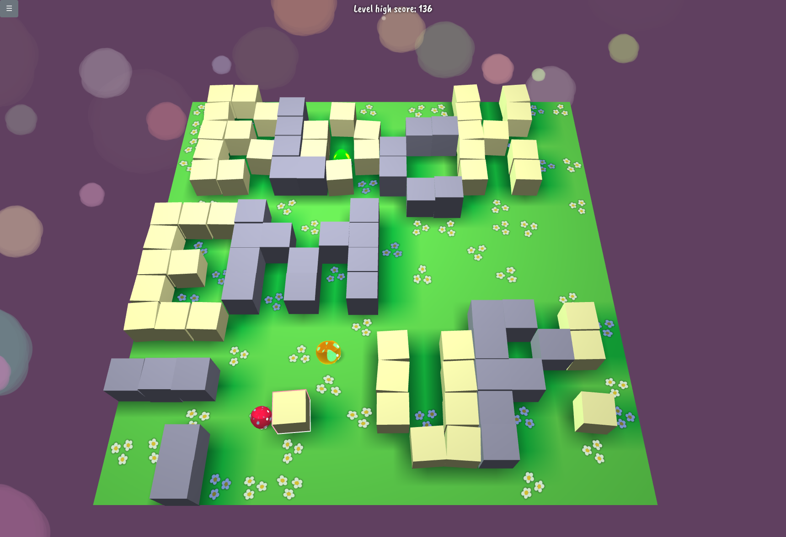

# Clave

Play in Browser: https://benkeks.itch.io/clave

[](https://benkeks.itch.io/clave)

(On benkeks.itch.io/clave, you'll find the most recent tagged version. The current version of the `main` branch is deployed to <https://clave.keks.in/>.)

## The game

Clave is a casual game about trapping monsters with boxes. You win a level by creating an area safe from monsters. The bigger the area, the more points you receive.

You move using the arrow keys (or swiping for touch). Boxes are picked up and placed with space (or tapping for touch). Don't let the monsters jump on you!

## Building

In order to build the source, you will need [sbt](https://www.scala-sbt.org/). It will take care of downloading the relevant dependencies.

```
sbt
fastOptJS
```

This will build the game to `target/scala-2.13/classes`.

## Background

[benkeks](https://github.com/benkeks) originally developed Clave overnight for an assignment in the [Game Programming course 2012 at TU Berlin](https://www.eecs.tu-berlin.de/institut_fuer_technische_informatik_und_mikroelektronik/cg_archiv/menue/teaching/ss2012/game_programming/). The present version is a Scala.js rewrite using Three.js.